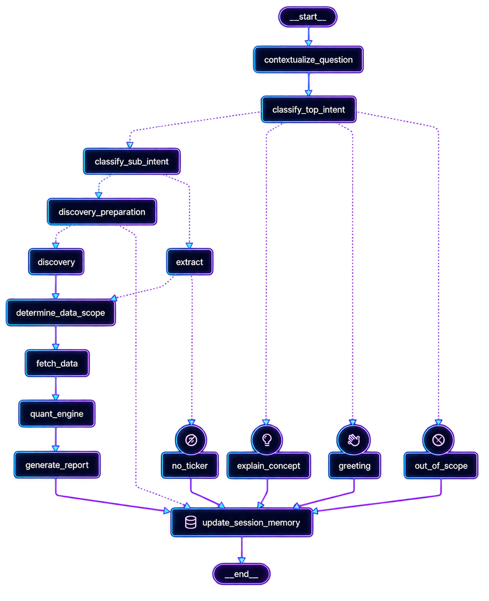

# equitymind-core

The backend of EquityMind: an agentic RAG system that answers plain-English
questions about US-listed equities with retrieved filings, computed
quantitative signals, and an explicit account of where each answer came from.

This repository holds everything that decides what an answer contains — the
LangGraph pipeline, the quant engine, the data readers, the SEC ingestion
pipeline, and the HTTP/WebSocket API. It is the only one of the three
repositories that talks to a database or to an LLM.

---

## The three repositories

| Repository | Role |
|---|---|
| `equitymind-core` | This one. Agent graph, quant signals, readers, API, database. |
| `equitymind-web-backend` | Thin proxy. Terminates the browser WebSocket and forwards to core. No business logic, no database. |
| `equitymind-web-frontend` | React + Vite SPA, deployed on Vercel. |

The split exists so the consumer product and any future third-party
integration enter through the same door: `equitymind-web-backend` is simply the
first client of core's API, not a privileged path into it. Authentication is
core's job — `/query/stream` checks the `Authorization` header itself and
closes with code 4001 on failure — which is why the proxy holds no auth logic
of its own.

---

## How a question is answered

Every request enters the graph at `contextualize_question` and leaves at
`update_session_memory`. Between those two, the route depends on what the
question turns out to be.

<p align="center">
  
</p>

<p align="center">
  <em>Figure 1. The agent graph, rendered from <code>graph.py</code>.</em>
</p>

Regenerate after changing the graph — the image comes from the compiled graph
itself, so it cannot drift from the code:

```bash
python3 -c "
from src.agent.graph import equitymind_graph
open('docs/img/graph.png','wb').write(equitymind_graph.get_graph().draw_mermaid_png())
"
```

`draw_mermaid_png()` renders through mermaid.ink and needs network access.
`draw_mermaid()` returns the diagram source as text instead, which can be
pasted into any Mermaid renderer.

Four things about this shape are worth knowing before changing it.

**`contextualize_question` runs unconditionally**, with no bypass. Its output
feeds intent classification, ticker extraction and scope selection, so a bad
rewrite is a bad rewrite for the whole request.

**`discovery_preparation` is a gate, not a preprocessing step.** Discovery
narrows a pool by ranking it on fields it holds data for; with no rankable
field, every stage is a no-op and the entire pool comes back looking like an
answer. The gate reads the raw `state["question"]`, parses it, and passes it
through only if the parse produced something rankable — otherwise it writes a
clarifying question and the turn ends. It folds conversation history into the
question **only when the previous turn left a Discovery request open**
(`in_clarification`); doing that unconditionally carried an old exchange into
every question after it.

**Both paths converge on `determine_data_scope`**, which decides which of the
nine sources this question needs. It reads
`enriched_query → contextualized_question → question`, in that order — after a
multi-turn Discovery exchange the latest message is a fragment ("the cheapest
ones") and only the enriched question still carries what was asked for. Scope
is decided from the question rather than from Discovery's parsed ranking
fields, because the two answer different things: "companies with major recent
risks" parses to `risk_beta_score`, a price-volatility measure, while what the
question needs is `sec_filing`.

**Every branch converges on `update_session_memory`**, including the greeting
and out-of-scope handlers. Anything written to session state there is written
on every path, not only the analytical ones.

---

## Project Structure

```bash
equitymind-core/
├── api/                                   # FastAPI app — all routes under /api/v1
│   ├── main.py                            # app setup, router registration
│   ├── auth.py                            # API key verification
│   ├── schemas.py                         # request / response models
│   └── routes/
│       ├── query.py                       # WS   /query/stream — main path, streams tokens
│       ├── research.py                    # POST /query/sync — blocking, for batch scripts
│       ├── pipeline.py                    # /internal/run-pipeline/* — what Kestra calls
│       └── health.py                      # GET  /health
├── core/                                  # cross-layer plumbing — imports nothing from api/ or src/
│   └── context.py                         # per-request token queue (ContextVar)
├── src/
│   ├── agent/
│   │   ├── graph.py                       # graph construction and routing
│   │   ├── state.py                       # AgentState (TypedDict)
│   │   ├── capabilities.py                # capability list shared by the three handlers
│   │   ├── discovery_types.py             # DiscoveryQuery, RankField, field vocabulary
│   │   ├── nodes_notifications.py         # per-node progress strings
│   │   ├── nodes/
│   │   │   ├── contextualize_question.py  # rewrite the question from session history
│   │   │   ├── classify_top_intent.py     # TASK / CONCEPT / GREETING / OUT_OF_SCOPE
│   │   │   ├── classify_sub_intent.py     # DISCOVERY / SPECIFIC_STOCK / COMPARISON / ...
│   │   │   ├── discovery_preparation.py   # the gate — parse, or ask for a rankable field
│   │   │   ├── discovery_execution.py     # multi-stage ranked filtering, discovery note
│   │   │   ├── discovery_counts.py        # how many tickers each stage passes on
│   │   │   ├── extract_tickers.py         # ticker(s) from the question
│   │   │   ├── determine_data_scope.py    # which of the nine sources this question needs
│   │   │   ├── fetch_data.py              # retrieve only what the scope named
│   │   │   ├── quant_engine.py            # run the signals over fetched data
│   │   │   ├── generate_report.py         # the answer — streamed, seven display rules
│   │   │   ├── explain_concept.py         # general finance questions
│   │   │   ├── handle_greeting.py         # greeting + what the system can do
│   │   │   ├── handle_no_ticker.py        # no company could be identified
│   │   │   ├── handle_out_of_scope.py     # outside equities research
│   │   │   └── update_session_memory.py   # terminal node on every path
│   │   └── formatters/                    # retrieved data -> prompt text, one per source
│   │       ├── snapshot_formatter.py
│   │       ├── valuation_formatter.py
│   │       ├── momentum_formatter.py
│   │       ├── risk_formatter.py
│   │       ├── quality_formatter.py
│   │       ├── consensus_formatter.py
│   │       ├── short_formatter.py
│   │       ├── news_sentiment_formatter.py
│   │       ├── sec_formatter.py
│   │       ├── financial_history_formatter.py
│   │       ├── quant_signals_formatter.py
│   │       └── conversation_formatter.py
│   ├── quant/                             # signal computation — pure functions, no I/O
│   │   ├── valuation_signal.py            # P/E, P/B against the FMP peer median
│   │   ├── momentum_signal.py             # 12-1 momentum, 52-week position
│   │   ├── risk_signal.py                 # beta, Sharpe, VaR, max drawdown
│   │   ├── quality_signal.py              # Piotroski F-Score
│   │   ├── consensus_signal.py            # analyst ratings and target prices
│   │   ├── short_signal.py                # short interest, days to cover
│   │   ├── news_sentiment_signal.py       # FinBERT — never cached, always live
│   │   └── *_signal_config.py             # thresholds for risk / quality / consensus / short
│   ├── readers/                           # data access — one reader per source or table
│   │   ├── snapshot_reader.py
│   │   ├── valuation_reader.py
│   │   ├── momentum_reader.py
│   │   ├── risk_reader.py
│   │   ├── quality_reader.py
│   │   ├── consensus_reader.py
│   │   ├── short_reader.py
│   │   ├── news_reader.py
│   │   ├── sec_reader.py
│   │   └── financial_history_reader.py
│   └── sec_pipeline/                      # 10-K ingestion
│       ├── sec_downloader.py              # fetch and section a filing
│       ├── sec_types.py                   # chunk types
│       ├── embedder.py                    # OpenAI embeddings
│       └── pgvector_store.py              # write and query sec_chunks
├── scripts/
│   ├── init_db_*.py                       # schema creation, five tables, idempotent
│   ├── build_stock_universe.py            # 1. membership, market cap, company name
│   ├── update_common_names.py             # 2. short news-headline name
│   ├── update_peer_groups.py              # 3. FMP peer group
│   ├── update_stock_overviews.py          # 4. 10-K Item 1 -> business overview
│   ├── update_industry_tags.py            # 5. overview -> industry tags
│   ├── update_momentum_benchmarks.py      # 6. momentum, 52-week position
│   ├── update_financial_history.py        # 7. 33 metrics, annual + quarterly
│   ├── update_quant_signals.py            # 8. six signals, precomputed
│   └── filing_check.py                    # shared module, not a pipeline step
├── docs/
│   ├── data-pipeline-reference.md         # authoritative pipeline documentation
│   ├── img/graph.png                      # generated from graph.py
│   └── kestra/                            # copy of the flow definition — not the live one
├── tests/
│   ├── test_quant.py                      # signal functions
│   ├── test_nodes.py                      # graph nodes
│   ├── test_api.py                        # HTTP layer
│   └── websocket_debug_tool.py            # exercise the streaming path without a browser
├── config.py                              # model names, env vars, tuning constants
├── colors.py                              # gprint / mprint — coloured node output
├── conftest.py                            # pytest configuration
├── railway.toml                           # deployment configuration
└── requirements.txt
```

Nodes are listed in the order a request passes through them, not
alphabetically. The eight numbered scripts run in that order daily; only three
of those orderings are load-bearing (see below). `filing_check.py` sits among
them but is not a pipeline step — it is a shared module (`is_usd_reporter`,
`files_20f_only`) that keeps the universe to US-reporting, 10-K-filing
companies.

The `agent → readers → quant → formatters` separation is deliberate and load
bearing: **RAG handles fact retrieval, quant handles signal computation, and
the LLM only turns already-computed results into prose.** A node that computes
a ratio, or a quant function that opens a database connection, is a bug even
if it works.

---

## Setup

```bash
conda activate equitymind-core
pip install -r requirements.txt
```

`.env` in the repository root:

| Variable | Purpose | Required |
|---|---|---|
| `OPENAI_API_KEY` | LLM calls and embeddings | yes |
| `DATABASE_URL` | PostgreSQL connection string | yes |
| `FMP_API_KEY` | Peer groups, financial data. 250 requests/day. | yes |
| `FINLIGHT_API_KEY` | News retrieval | yes |
| `PIPELINE_TRIGGER_SECRET` | Shared secret for the Kestra endpoints. Must match the value set in Kestra, or every trigger returns 401. | yes |
| `PIPELINE_THROTTLE_SECONDS` | Per-ticker sleep in the yfinance-calling scripts. Defaults to `0`; production uses `2`. | no |

Models are set in `config.py`, not the environment:

```python
LLM_MODEL       = "gpt-5.2"        # reports, classification, Discovery
LLM_MODEL_LIGHT = "gpt-4o-mini"    # ticker extraction, data scope, news, greeting
```

---

## Database

Five tables. `scripts/init_db_*.py` create the schemas; the `update_*` scripts
populate them.

| Table | Contents | Refreshed |
|---|---|---|
| `stock_universe` | 250 tickers: market cap, names, 10-K business overview, industry tags, peer group | daily |
| `financial_history` | 33 financial metrics, annual and quarterly | daily |
| `momentum_benchmarks` | Momentum indicators, 52-week price position | daily |
| `quant_signals` | Six precomputed signals, each stored whole as JSONB plus scalar columns for screening | daily |
| `sec_chunks` | 10-K chunks and their embeddings, for pgvector retrieval | on demand, at query time |

### Cold start

Create the schemas first, then run the eight pipeline scripts in the order
given in `docs/data-pipeline-reference.md`:

```bash
python scripts/init_db_stock_universe.py
python scripts/init_db_financial_history.py
python scripts/init_db_momentum_benchmarks.py
python scripts/init_db_quant_signals.py
python scripts/init_db_sec_chunks.py

python scripts/build_stock_universe.py
python scripts/update_common_names.py
python scripts/update_peer_groups.py
python scripts/update_stock_overviews.py
python scripts/update_industry_tags.py
python scripts/update_momentum_benchmarks.py
python scripts/update_financial_history.py
python scripts/update_quant_signals.py
```

The `init_db_*` scripts are idempotent — every statement in them is
`CREATE ... IF NOT EXISTS`, so running them against a populated database does
nothing and destroys nothing.

**They are not migration tools.** If a table already exists with an older
schema, the script silently does nothing: no error, no change. Altering a
schema means doing it by hand, as the 2026-08-17 `overview_embedding` removal
did — rename the old table, run the init script to create the new one, copy the
data across, verify, then drop the backup.

A first run is slow and expensive: every overview is generated from ~50k
characters of Item 1 text, every ticker is tagged, and nothing is cached yet.
Subsequent runs are incremental and usually no-ops.

`sec_chunks` needs no bulk load — filings are fetched, chunked and embedded the
first time a question asks for one.

---

## The daily pipeline

Eight scripts, one Kestra flow, 04:00 UK time. Kestra does not run the scripts
itself: it calls this repository's `/internal/run-pipeline/` endpoints and
polls each one to completion before triggering the next.

**`docs/data-pipeline-reference.md` is the authoritative document for all of
this** — the dependency graph, which orderings are load-bearing and which are
arbitrary, Kestra timeouts and their rationale, the yfinance and FMP
rate-limit findings, the log lines each script emits, and the current known
issues. Read it before changing anything about the pipeline.

The three dependencies that actually constrain the order:

1. `build_stock_universe.py` first — it decides who is in the universe.
2. `update_stock_overviews.py` before `update_industry_tags.py` — tags are
   extracted from the overview text, not from the filing.
3. `update_momentum_benchmarks.py` and `update_financial_history.py` before
   `update_quant_signals.py` — signals are computed from those two tables.

Everything else can be reordered or run alone.

`docs/kestra/equitymind_daily_pipeline.yml` is a copy of the flow definition,
kept here for version control and review. **Editing it changes nothing** — the
flow that runs lives in the Kestra instance and must be edited there.

Registering a new pipeline script takes two edits that must both happen: add it
to `ALLOWED_SCRIPTS` in `api/routes/pipeline.py`, and add the trigger/wait task
pair to the Kestra flow. Push the code first, wait for the redeploy, then add
the Kestra tasks — the other order gives a 404 on the first run.

---

## Running locally

```bash
uvicorn api.main:app --reload
```

- WebSocket: `ws://localhost:8000/api/v1/query/stream`
- Sync query: `POST http://localhost:8000/api/v1/query/sync`

`tests/websocket_debug_tool.py` connects to the WebSocket endpoint without a
browser, which is the quickest way to exercise the full streaming path. Batch
experiments can skip the API entirely and invoke the graph directly, or use
`/query/sync`.

Several Discovery modules have a `__main__` block for exercising one node in
isolation — `discovery_preparation.py` takes an `--isolate` flag that clears
conversation state between questions, which is what a repeated single-turn test
needs and exactly wrong for a multi-turn one.

---

## Tests

```bash
pytest
```

113 tests, all passing as of 2026-08-28. The suite takes about three and a half
minutes. `tests/test_quant.py` covers the signal functions,
`tests/test_nodes.py` the graph nodes, `tests/test_api.py` the HTTP layer.

---

## Conventions

Established over the life of the project, and worth keeping:

- **A failure must never be recorded in a form indistinguishable from a
  success.** This one has been paid for three times: `update_peer_groups.py`
  writing `[]` for both "no peers exist" and "the request failed", so a
  transient error became permanent; `build_stock_universe.py` treating a
  rate-limited fetch as "did not make the top 250", which deleted fourteen
  mega-caps along with their overviews, tags and peers; and the pipeline
  endpoint returning `status: success` for a run whose every request came back
  401. A step that records what its output was derived from can recover on its
  own; a step that just overwrites cannot.
- **Anything expressible as deterministic code is not delegated to a prompt.**
  The LLM's job is to phrase results, not to compute them, and not to normalise
  a fixed shape that code can normalise exactly.
- **Diagnosable failures beat invisible waste.** An empty scope produces a
  visibly incomplete report and a user who complains; nine unnecessary signal
  fetches produce eighteen silent seconds and a larger bill.
- **Bounded failure modes beat unbounded ones.** Exact tag lookup fails as a
  known gap. Similarity ranking fails as "no threshold worked."
- **Claims trace to a primary source** — the filing text, the code, a query
  result. Not to recollection.
- **Imperative prompt headings, not descriptive ones.** Sections phrased as
  descriptions get ignored; sections phrased as instructions
  (`SELECTION SCOPE (say this in your answer):`) are obeyed. And changing a
  rule without changing the worked examples beneath it changes nothing — the
  examples win.
- Code and comments in English throughout.
- Patches are applied as Python here-documents with an `assert old in s` guard
  and an immediate `ast.parse` check.
